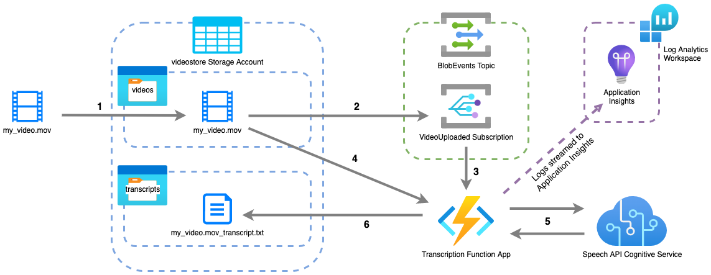

# Automated Video Transcription with Azure Functions

## Contents

## Overview



1. Video file is uploaded to blob storage into a container named "videos".

2. The VideoUploaded Event Grid Subscription listens for new BlobCreated events in the videos container in the "videostore" Storage Account.

3. VideoUploaded Subscription is associated with the Function App's endpoint and triggers the function to run.

4. Transcription App downloads the video blob to temporary file storage and extracts the audio file.

5. Transcription App sends the audio to the Speech API Cognitive Service, which responds with the text of the transcription it has generated.

6. The received transcription is saved to a text blob in the "transcripts" container in the "videostore" Storage Account. 

## Installation

### Prerequisites

You will need the following installed on your machine:

- [Terraform](https://learn.microsoft.com/en-us/azure/azure-functions/functions-run-local?tabs=v4%2Cmacos%2Ccsharp%2Cportal%2Cbash#install-the-azure-functions-core-tools)
- [Azure CLI](https://learn.microsoft.com/en-us/cli/azure/install-azure-cli#install) (fully authenticated)
- [Azure Functions Core Tools](https://learn.microsoft.com/en-us/azure/azure-functions/functions-run-local?tabs=v4%2Cmacos%2Ccsharp%2Cportal%2Cbash#install-the-azure-functions-core-tools)

Create the infrastucture by applying the Terraform configuration found in [this repository](https://github.com/htr-volker/transcript-app-terraform) by running the following within the cloned repo:

```bash
terraform apply
```

### Deployment

Create a Python virtual environment:

```bash
python -m venv venv
```

Install Python packages using:

```bash
pip install -r requirements.txt
```

Publish the app with:

```bash
func azure functionapp publish <APP_NAME>
```

Replacing `<APP_NAME>` with your function app's name. The Terraform configuration is set to create a function app named `transcript-app-func-app`.

Create an Event Grid Subscription which will notify the function of any new blob created in the "videos" container in the storage account provisioned by Terraform:

```bash
az eventgrid system-topic event-subscription create \
    --name VideoUploaded \
    --resource-group transcript-app \
    --system-topic-name BlobEvents \
    --endpoint $(az functionapp function show -g transcript-app -n transcript-app-func-app --function-name TranscribeVideoTrigger -o json | jq .id -r) \
    --endpoint-type azurefunction \
    --subject-begins-with "/blobServices/default/containers/videos" \
    --included-event-types "Microsoft.Storage.BlobCreated"
```

## Acknowledgements

Initially inspired by the code found on José Fernando Costa's blog post: *Transcribe audio from video with Azure Cognitive Services* ([source](https://medium.com/nerd-for-tech/transcribe-audio-from-video-with-azure-cognitive-services-a4589a12d74f)).
